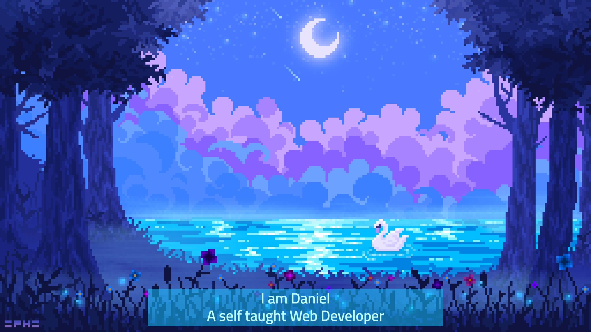

  

    <h2>:man_technologist:About me</h1>
    
     

  Former IT guy that discovered his passion for Web Development. 
  I am a self taught front-end developer (on my way to full-stack). 
  I love seeing mockups transform into a fully functional websites. 
   
  

    

  <h2>:hammer_and_wrench: Languages & Tools:</h2>
  

    

  &nbsp;
  &nbsp;
  &nbsp;
  &nbsp;
  
  
  

  

 

